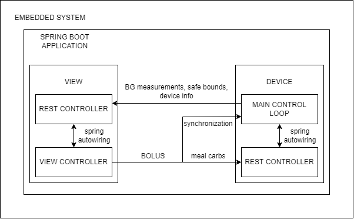
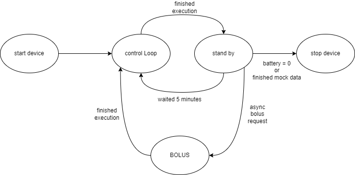

# InsulinicPump
Progetto per fondamenti d'ingegneria del software

# Contenuti
&emsp;[1.Descrizione progetto](#descrizione)  
&emsp;[2.Architettura generale](#architettura)  
&emsp;[3.Requisiti](#requisiti)   
&emsp;&emsp;[3.1.Requisiti non funzionali](#rnf)  
&emsp;&emsp;[3.2.Requisiti funzionali](#rf)  
&emsp;[4.Scenari](#scenari)  
&emsp;[5.Design](#design)  
&emsp;[6.Quality assurance](#qa)  
  

# Descrizone progetto 
Sistema di somministrazione automatizzata d' insulina per persone affette da diabete, che permette di mantenere la glicemia (sia a digiuno che dopo i pasti) entro un'intervallo sicuro.
Il dispositivo, a intervalli regolari di tempo, acquisisce il livello di glucosio nel sangue tramite un sensore, successivamente  calcola la dose correttiva di insulina ed infine la rilascia tramite una pompa.

# Architettura generale 
Questa è l'architettura ideata da per rispondere ai requisiti.  
L'intero applicativo consiste in un'applicazione spring boot che avvia in parallelo i due componenti principali, la view ed il main control loop.

La scelta fondamentale che ha portato a questa strutturazione del software è quella di separare i componenti che gestiscono il dispositivo (il controllore) da quelli che visualizzano
i dati di quest'ultimo. La ragione sta nell'assunzione che il controllore abbia una maggiore importanza rispetto alla view, che può essere giustificata dalle seguenti ragioni:
* Il controllore interagisce direttamente con i componenti che interagiscono fisicamente con l'utente  (sistema safety-critical)
* I cambiamenti nel livello di glucosio nel sangue non sono istantanei (richiedono parecchi minuti), e sono prevedibili.
* Il controllore potrebbe essere soggetto a dei vincoli di tempo di esecuzione in CPU, il che potrebbe portare all'impiego di librerie REAL TIME che richiedono particolari sistemi operativi e/o configurazioni

## Descrizione della view
La view è un web server che consta di due compnenti:
* ***rest controller***:  
riceve i dati forniti dal controllore tramite richieste HTTP POST e li salva nelle strutture dati condivise con il view controller tramite il meccanismo fornito da spring chiamato autowiring
  
* ***view controller***:  
legge le entry nelle strutture dati e le mette a disposizione delle due pagine HTML: chart e bolus, dove verranno visualizzate tramite javascript.  
Inoltre si sincronizza con il main control loop per il calcolo e inoculazione della dose d'insulina post-pasto, denominata **BOLUS**.

## Descrizione del device
Il device è il componente che fornisce l'implementazione del funzionamento del dispositivo. È strutturato nel seguente modo:
* **hardware**:  
astrazioni software che permettono d'interagire con i dispositivi fisici (e.g. sensore della glicemia, pompa di iniezione etc...) tramite dei wrapper che interagiscono con i driver.
* **pump controller**:  
i cui attori principali sono: 
  * ***controllore***: implementa le funzionalità safety-critical del sistema
  * ***rest controller***: riceve l'input dell'utente per il calcolo del *BOLUS*
* ***main control loop***:  
istanzia un controllore e utilizza le sue funzionalità seguendo una procedura che può essere vista come una macchina a stati:  

* *START DEVICE*: esegue l'autodiagnostica dei componenti hardware per verificarne il corretto funzionamento
* *CONTROL LOOP*: legge i dati forniti dal sensore di glicemia, calcola la dose d'insulina necessaria e la inocula. Riesegue l'autodiagnostica e invia le informazioni del dispositivo alla view. Infine aggiorna il display.
* *STAND BY*: Il device aspetta la fine del timer risparmiando batteria
* *BOLUS*: quando l'utente richiede questa funzionalità tramite la view, l'esecuzione dello standby si blocca. Viene aperto un nuovo thread in cui, non appena l'utente avrà inserito i carboidrati ingeriti durante il pasto, verrà calcolata e inoculata la dose correttiva d' insulina 
* *STOP DEVICE*: viene spento il dispositivo
# Requisiti 
## Requisiti non funzionali 
* Il sistema deve essere affidabile nella sua interezza. Di ogni componente (hardware e software) deve essere assicurato il corretto funzionamento a intervalli regolari di un minuto. In caso d'irregolarità, l'utente deve essere immediatamente avvisato dell'inoperatività del dispositivo
* Le quantità d'insulina rilasciate devono mantenere la glicemia entro valori sicuri: tra i 72 e i 126 mg/dl   
* Deve essere permesso al sistema di rilasciare insulina quando l'utente lo richieda
* Le misurazioni di glicemia devono essere effettuate regolarmente a intervalli di 5 minuti, in quanto i cambiamenti del livello di glucosio nel sangue ne richiedono diversi
* La durata della batteria deve essere massimizzata

## Requisiti funzionali 
* Ogni componente hardware del sistema (pompa, sensore e batteria) deve essere in grado, tramite i relativi driver, di eseguire un'autodiagnostica e di ritornare al software di controllo lo stato di funzionamento
* Il sistema deve avvertire l'utente quando le scorte d'insulina sono prossime a terminare. Lo stesso per quanto riguarda il livello di batteria del dispositivo
* Il sistema deve avvertire l'utente di glicemia alta o bassa
* Dopo i pasti il sistema permette all'utente d'inserire i carboidrati ingeriti in modo da rilasciare la giusta quantità d'insulina richiesta per mantenere la glicemia in un intervallo sicuro
# Scenari 
1. Inoculazione dose post pasto (*BOLUS*)
   - **attori**: utente del sistema
   - **descrizione**: l'utente, appena dopo il pasto, clicca sul bottone "BOLUS" nella view "chart", inserisce i grammi di carboidrati ingeriti durante il pasto, e schiaccia il tasto conferma.
   Appena appare il tasto "deliver", l'utente lo preme. Il controllore calcola la dose d'insulina necessaria e la inocula.
   - **dati**: ultima misurazione della glicemia nel sangue (misurata dal sistema), carboidrati ingeriti (inseriti dall'utente)
   - **output**: in caso l'utente richieda la dose di BOLUS quando l'attuale livello glicemico è minore o uguale a 126 mg/dl (probabilmente prima del pasto) il sistema avverte l'utente della possibilità d'incorrere in uno stato d'ipoglicemia
   ma gli permette di procedere comunque. Nell'altro caso (glicemia attuale > 126 mg/dl) il sistema calcola la dose d'insulina e la inocula
2. visualizzazione stato della batteria
   - **attori**: utente del sistema
   - **descrizione**: l'utente visualizza lo stato della batteria nella view 
   - **dati**: percentuale del livello della batteria
   - **output**: quando il livello della batteria è inferiore al 20%, il sistema avverte l'utente, altrimenti lo visualizza a schermo
3. visualizzazione stato della riserva d'insulina
   - **attori**: utente del sistema
   - **descrizione**: l'utente visualizza lo stato della riserva d'insulina nella view
   - **dati**: percentuale del livello della riserva d'insulina
   - **output**: quando il livello della riserva d'insulina è inferiore al 20%, il sistema avverte l'utente, altrimenti lo visualizza a schermo
4. inoculazione dose d'insulina avendo minimo 2 misurazioni
   - **attori**: utente del sistema
   - **descrizione**: il sistema ha accumulato due misurazioni della glicemia, appena riceve la terza misurazione calcola la dose correttiva d'insulina richiesta
   - **dati**: l'attuale livello glicemico (r2) e le due misurazioni precedenti (r0,r1)
   - **output**:  
     - *r2 < r1* : glicemia in calo, dose : 0
     - *r2 = r1* : glicemia costante, se è inferiore o uguale a 126 mg/dl dose:0, altrimenti dose: dose minima
     - *r2 > r1* : glicemia in crescita, se il rate di crescita sta diminuendo: dose 0, altrimenti: dose = arrotonda((r2 - r1)/4), se dose arrotonda a zero, dose = dose minima 
   - **problemi**:
5. visualizzazione dello stato del dispositivo
   - **attori**: utente del sistema
   - **descrizione**: l'utente del sistema visualizza lo stato di funzionamento del dispositivo
   - **dati**: stato attuale dei componenti hardware 
   - **output**: se almeno uno dei componenti hardware presenta dei problemi, il sistema avverte l'utente, altrimenti visualizza "OK"

# Quality assurance 
## Acceptance tests
Nel package acceptance ho implementato i casi di test per 4/5 scenari descritti sopra. Non sono riuscito a scrivere il caso di test per il primo scenario in quanto:
* Se MainControlLoop non viene marcato come @MockedBean, i test vengono istanziati dopo che questo finisce di eseguire, cosa che comporta l'uscita dall'intera applicazione 
* Non ho trovato il modo di avviare programmaticamente un'altra istanza dell'intera applicazione, in modo da poter avviare il caso di test parallelamente da essa
Durante lo sviluppo della feature che risponde allo scenario ho comunque avuto modo di testarne la correttezza.
## Code Coverage
Complessivamente i test hanno prodotto le seguenti statistiche di code coverage:
* *class*: 94%
* *Method*: 72%
* *Line*: 74%